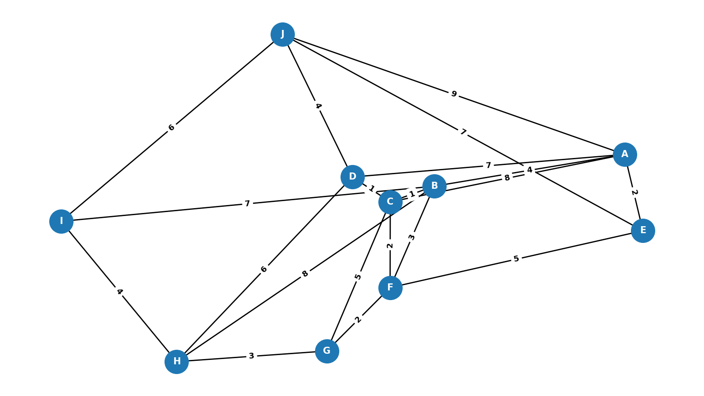
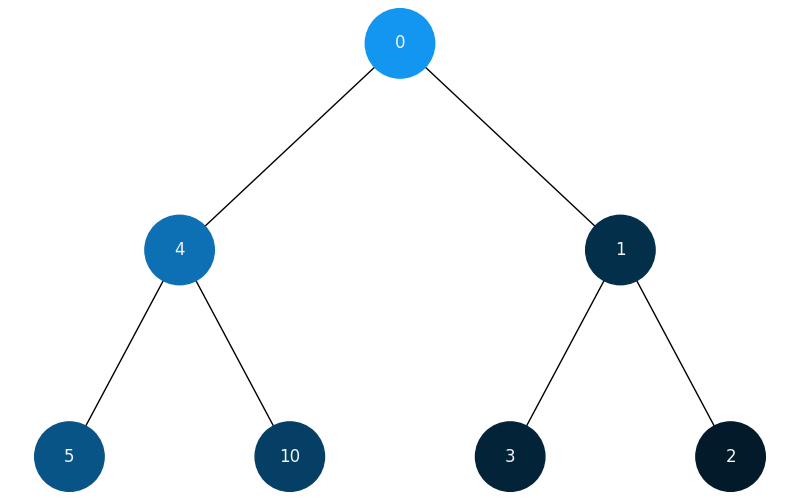

# goit-algo-fp

## Завдання 1. Структури даних. Сортування. Робота з однозв'язним списком

Було розширено однозв'язний список наступним функціоналом:

- функція, яка реалізує реверсування однозв'язного списку, змінюючи посилання
  між вузлами
- функція сортування однозв'язного списку вставками
- функція, що об'єднує два відсортовані однозв'язні списки в один відсортований
  список.

Результати виконання коду:

## Завдання 2. Рекурсія. Створення фрактала "дерево Піфагора" за допомогою рекурсії

Програму використовує рекурсію для створення фрактала "дерево Піфагора" з
можливістю задавати рівень рекурсії.

## Завдання 3. Дерева, алгоритм Дейкстри

Розроблено метод, який використовує алгоритм Дейкстри для знаходження
найкоротших шляхів у зваженому графі, використовуючи бінарну купу.

## Завдання 4. Візуалізація піраміди

Реалізовано перетворення бінарного дерева на піраміду (масимальну або
мінімальну). Для наглядності використаємо перетворення вихідного дерева в
максимальну піраміду. Також в оригінальне дерево було додано ще один вузол для
кращої візалізації.

## Завдання 5. Візуалізація обходу бінарного дерева

Візуалізовано обхід бінарного дерева за допомогою затемнення кольорів вершин при
траверсуванні:

### Послідовність BFS обходу

### Послідовність DFS обходу

## Завдання 6: Жадібні алгоритми та динамічне програмування

Програмно реалізовано

- функцію `greedy_algorithm` жадібного алгоритму, яка вибирає страви,
  максимізуючи співвідношення калорій до вартості, не перевищуючи заданий бюджет
- функцію `dynamic_programming` на основі алгоритму динамічного програмування,
  яка обчислює оптимальний набір страв для максимізації калорійності при
  заданому бюджеті.

Результати:

## Завдання 7: Використання методу Монте-Карло

Порівняльна таблиця ймовірностей випадіння суми кубиків на основі **1000000**
еспериментів:

| Сума | Ймовірність | Монте-Крало | Різниця |
| ---- | ----------- | ----------- | ------- |
| 2    | 2.7800      | 2.8062      | -0.0262 |
| 3    | 5.5600      | 5.5219      | 0.0381  |
| 4    | 8.3300      | 8.3759      | -0.0459 |
| 5    | 11.1100     | 11.1581     | -0.0481 |
| 6    | 13.8900     | 13.8963     | -0.0063 |
| 7    | 16.6700     | 16.6204     | 0.0496  |
| 8    | 13.8900     | 13.8683     | 0.0217  |
| 9    | 11.1100     | 11.1068     | 0.0032  |
| 10   | 8.3300      | 8.3095      | 0.0205  |
| 11   | 5.5600      | 5.5838      | -0.0238 |
| 12   | 2.7800      | 2.7528      | 0.0272  |

Можна зробити висновок, що при проведенні **1000000** еспериментів методом
Монте-Карло відхилення не перевищує **0.0496%**, що є хорошим показником.
